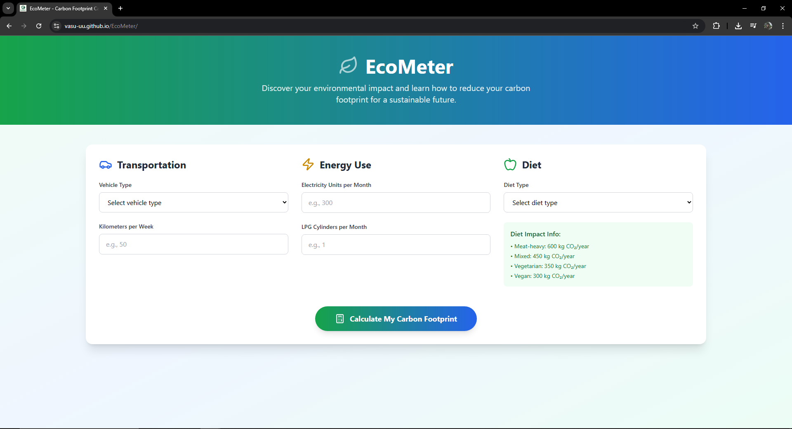
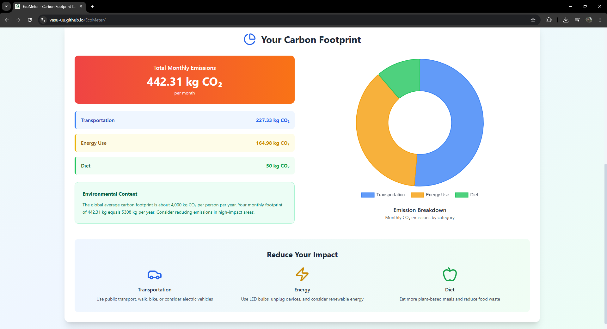

# 🌱 EcoMeter – Carbon Footprint Calculator

**EcoMeter** is a clean, responsive, and fully client-side web application that helps users estimate their monthly carbon footprint based on transportation, energy usage, and dietary habits. It’s designed to raise awareness and empower people to take actionable steps toward sustainability.

---

## 🚀 Live Preview

[🌐 View Site](https://vasu-uu.github.io/EcoMeter/)

---

## 🎥 Demo Video

[▶️ Watch Demo](https://vimeo.com/1097254159/a0ec1cfcde?ts=0&share=copy)

---

## ✨ Features

- 🌍 Estimate **monthly CO₂ emissions** in kilograms  
- 📊 **Interactive pie chart** showing emissions by category  
- ✅ **Form validation** with friendly error messages  
- 📱 Fully **responsive design**, mobile-first layout  
- 💡 **Personalized context**: compares your footprint to global average  
- 🌿 Practical **tips to reduce impact** based on user choices  
- ⚙️ **Single HTML file** — no frameworks, no build tools, no backend  

---

## 🧠 Technologies Used

| Technology           | Purpose                              |
|----------------------|---------------------------------------|
| HTML5                | Page structure                        |
| Tailwind CSS (CDN)   | Responsive, utility-first styling     |
| JavaScript (Vanilla) | Input handling and logic              |
| Chart.js (CDN)       | Emissions breakdown visualization     |
| Lucide Icons (CDN)   | Icons for categories and UI polish    |

---

## 👥 Team: NullPointers

### 🧑‍💻 [Vasudev V](https://github.com/Vasu-uu)
- Developed CO₂ **calculation logic** in JavaScript  
- Integrated and configured **Chart.js**  
- Handled all **DOM updates, result formatting, and interactivity**  
- Tested and fine-tuned logic and UI behavior  

### 👩‍💻 [Lakshmi Ratheesan](https://github.com/lakshmir-25)
- Designed the full **HTML structure and layout**  
- Implemented styling using **Tailwind CSS**  
- Authored **sustainability tips and labels**  
- Added **form styling, accessibility improvements, and icons**  

---

## 🛠 How It Works

1. User selects:
   - Vehicle type and distance traveled per week  
   - Monthly electricity and LPG usage  
   - Diet type  
2. On clicking **\"Calculate\"**, emissions are computed using fixed factors:
   - Car: 0.21 kg/km  
   - Electricity: 0.9 kg/unit  
   - LPG: 2.983 kg/cylinder  
   - Diet types: 600–300 kg/year, divided monthly  
3. Output includes:
   - Total emissions per month  
   - Breakdown by category  
   - A contextual comparison message  
   - A dynamic pie chart using Chart.js  

---

## 📸 Screenshots

### 🟢 Home Section  

### 📋 Form & Inputs  

### 📊 Results and Tips  

---

## 🧭 Hackathon Context

**EcoMeter** was built as part of **Sankalp 101 – India’s First Virtual 2D Environment Hackathon**, a 24-hour immersive online event hosted on **Gather.town**.

> Sankalp 101 is India’s first-ever 24-hour virtual 2D hackathon. This immersive online experience eliminates physical barriers, allowing participants to collaborate, innovate, and build impactful solutions in a fully interactive virtual space.

---

> Made with 💚 by Team **NullPointers** – Vasudev V & Lakshmi Ratheesan

